# Unit 10 - A Yen for the Future

### Assignment by Dorothy Doutre


## Assignment Summary:

For this assignment we are tasked with finding the future movements of the Canadian dollar value versus the Japanese Yen. This is done utilising the following techniques:

### Time series forecasting
```
Historical plotting.
Decomposition using a Hodrick-Prescott filter.
Forecasting returns via ARMA model.
Forecasting exchange via ARIMA model.
Forecasting volatility via GARCH.
```
### Linear Regression Forecasting
```
Data prepearation via percentage returns, creating lagged returns via shift method and Train Test split.
Fitting a linear regression model.
Making prediction via test data.
Out and In sample performance.
```
### Technologies used:
- GitBash
- Python
- Jupyter-lab (mlenv environment)
- VS Code

---

## Assignment findings:
### Historical plotting

Loaded the historical data of the Canadian Dollar-Yen exchange rate, the futures data and applied a time series analysis. Then modeled to determine whether there is any predictable behaviour.

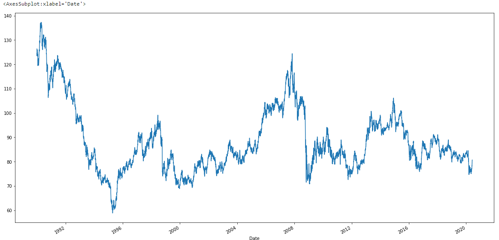

Long-term the cad-jpy price is affected but major financial events.

First big dip (lowest point) approx. late 1995 due to recession stemming from 1992 and the global recession late 2008/ early 2009 seeing the second biggest dip. Though it has periods where it is increasing, this seems to stablise since early 2000's at around 80 Yen. 

Short term from 2012 to around 2014 probably due to inflation.

### Hodrick-Prescott filter

Using a Hodrick-Prescott Filter to decompose the exchange rate price into trend and noise.

Image below is looking at Price vs Trend.

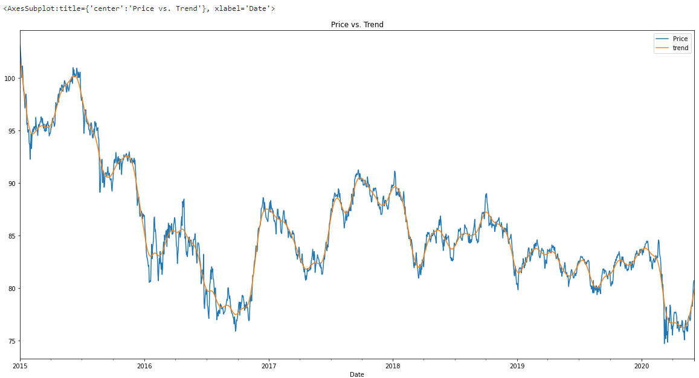

Image below is looking at Noise only.

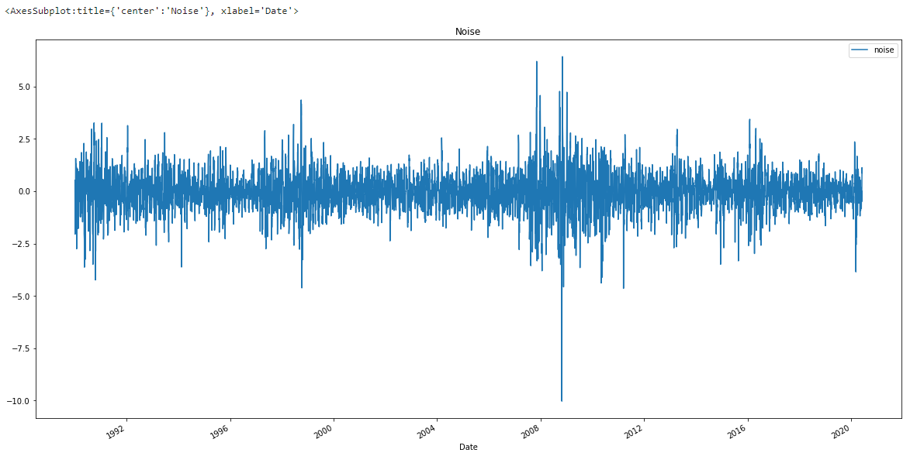

Stablising around 80 Yen since 2016. Also showing signs of stagnating between 2017 to 2020, where this dips to 75 Yen.

### Forecasting - ARMA model

An ARMA model, or Autoregressive Moving Average model, is used to provide a description of a weakly stationary average.

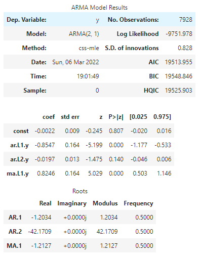

Then looked at a 5 day forecast based on the results above (ARMA model).

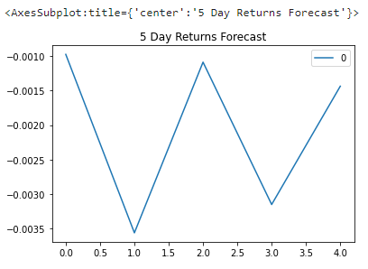

ARMA model has a P value greater than 0.05, suggesting this is not a good fit

### Forecasting - ARIMA model

ARIMA model below is applied when the data shows evidence that it is non-stationarity based on the mean.

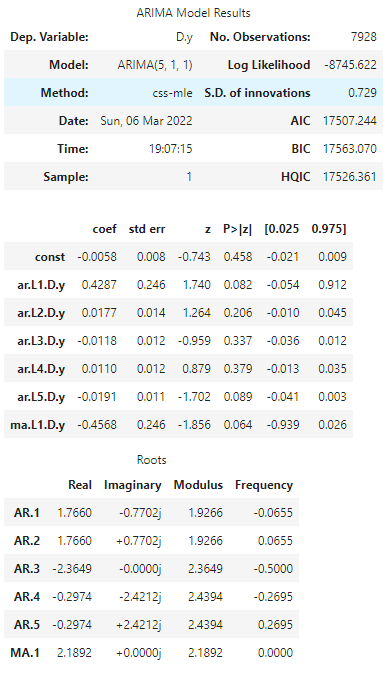

Then looked at a 5 day forecast based on the results above (ARIMA model).

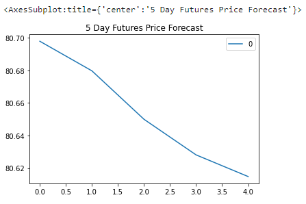

The above suggest within the near future the Yen will be decreasing in value.

### Forecasting - GARCH

Forecast near-term volatility of Japanese Yen exchange rate returns utilising the GARCH method below.

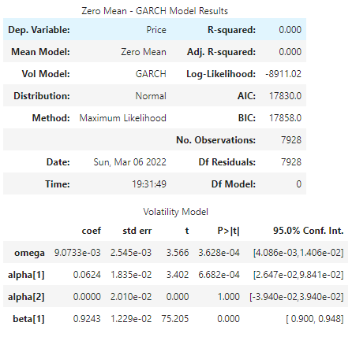

Then looked at a 5 day forecast on the volatility based on the results above (GARCH).


Suggesting an increase in volitility and therefore there will be greater risk buying the Yen at this time.

### Linear Regression model

Utilised the Scikit-Learn linear regression model to predict CAD/JPY returns with lagged CAD/JPY futures returns and categorical calendar seasonal effects based on the cad_jpy_df. 

Train period = 2017 and Test period = 2018

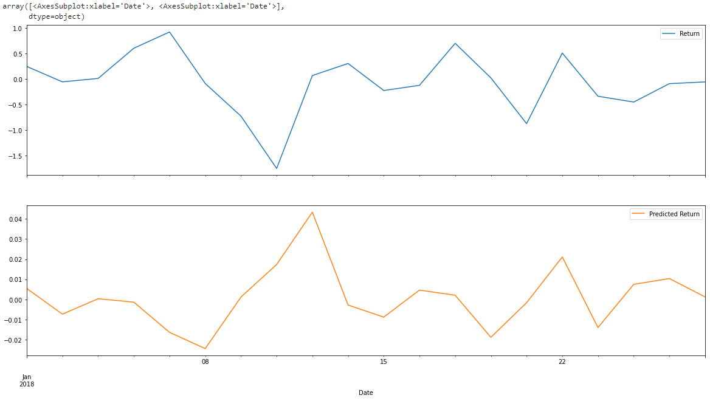

### Out and In sample performance

Below are the evaluation model using the (X_test and y_test) data.

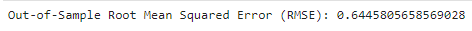

Below are the evaluation model using the (X_train and y_train) data.

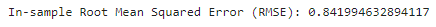

The RMSE for both in and out sample are greater than 0.5 indicating that it predicts the data accurately.

In this case, the out-of-sample RMSE is lower than the in-sample RMSE. RMSE is typically lower for training data, but is higher in this case.

---

## Final conclusions:

Based on the time series analysis, I would not buy yen at the moment as the ARMA and ARIMA models are suggesting increased volatility and a decrease in price over the next 5 days.

The ARIMA model is suggesting an increase in risk for the yen.

Based on all the models and results presented as they are consistent to the cad-jpy being a risky buy and a possible loss. I feel confident in using the models for trading.
