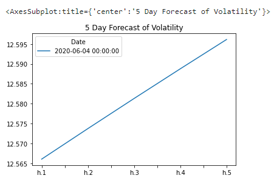

# Unit 10 - A Yen for the Future

### Assignment by Dorothy Doutre


## Assignment Summary:

For this assignment we are tasked with finding the future movements of the Canadian dollar value versus the Japanese Yen. This is done utilising the following techniques:

### Time series forecasting
```
Historical plotting.
Decomposition using a Hodrick-Prescott filter.
Forecasting returns via ARMA model.
Forecasting exchange via ARIMA model.
Forecasting volatility via GARCH.
```
### Linear Regression Forecasting
```
Data prepearation via percentage returns, creating lagged returns via shift method and Train Test split.
Fitting a linear regression model.
Making prediction via test data.
Out and In sample performance.
```
### Technologies used:
- GitBash
- Python
- Jupyter-lab (mlenv environment)
- VS Code

---

## Assignment findings:
### Historical plotting

Loaded the historical data of the Canadian Dollar-Yen exchange rate, the futures data and applied a time series analysis. Then modeled to determine whether there is any predictable behaviour.


### Hodrick-Prescott filter

Using a Hodrick-Prescott Filter to decompose the exchange rate price into trend and noise.

Image below is looking at Price vs Trend.


Image below is looking at Noise only.


### Forecasting - ARMA model

An ARMA model, or Autoregressive Moving Average model, is used to provide a description of a weakly stationary average.


Then looked at a 5 day forecast based on the results above (ARMA model).


### Forecasting - ARIMA model

ARIMA model below is applied when the data shows evidence that it is non-stationarity based on the mean.


Then looked at a 5 day forecast based on the results above (ARIMA model).


### Forecasting - GARCH

Forecast near-term volatility of Japanese Yen exchange rate returns utilising the GARCH method below.


Then looked at a 5 day forecast on the volatility based on the results above (GARCH).



### Linear Regression model

Utilised the Scikit-Learn linear regression model to predict CAD/JPY returns with lagged CAD/JPY futures returns and categorical calendar seasonal effects based on the cad_jpy_df. 

Train period = 2017 and Test period = 2018


### Out and In sample performance

Below are the evaluation model using the (X_test and y_test) data.


Below are the evaluation model using the (X_train and y_train) data.


The out-of-sample RMSE is lower than the in-sample RMSE. RMSE is typically lower for training data, but is higher in this case.